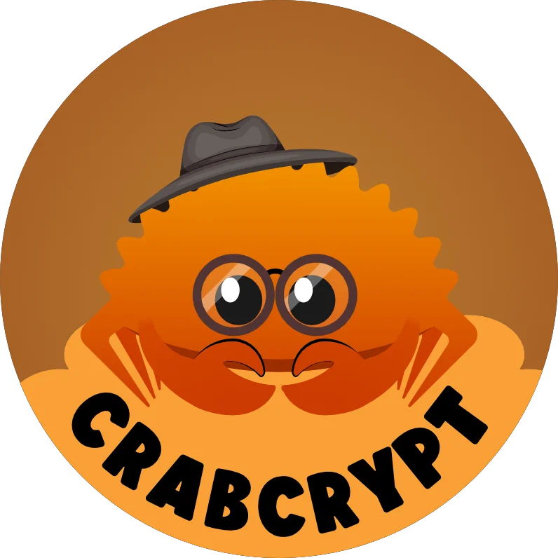

  

---

# crabcrypt

Welcome to Crabcrypt, a comprehensive cryptography library currently being developed in Rust.

## Status

The project is currently **under development**. As of now, the hashing functionality has been implemented.

## Features

Here are some of the main features that we plan to provide:

- A range of secure hashing algorithms including MD2, MD4, MD5, SHA1, SHA224, SHA256, SHA384, SHA512, and SM3.
- Support for multiple character encodings.
- Cipher options for advanced encryption and decryption methods (under development).
- Efficient and convenient APIs for developers.

## Implemented

### Hashing

Crabcrypt provides a set of hashing algorithms including:

- MD2
- MD4
- MD5
- SHA1
- SHA224
- SHA256
- SHA384
- SHA512
- SM3

More features will be implemented soon. Stay tuned!

## Contribution

As Crabcrypt is in its early development stages, we appreciate any and all contributions! Whether it's reporting bugs, suggesting new features, improving documentation, or writing code, all contributions are welcome.

## License

Crabcrypt is [MIT licensed](LICENSE).

## Disclaimer

As this project is still under development, it is recommended to use it for educational purposes and not in production environments until a stable version is released.
